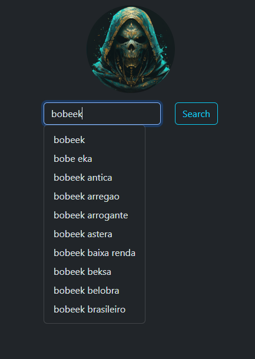
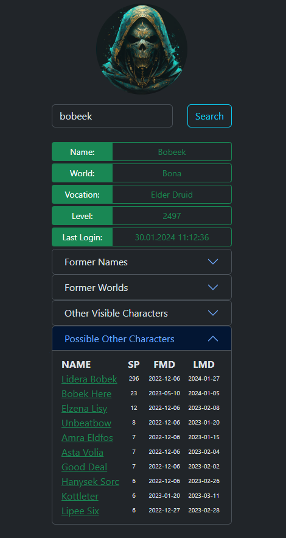
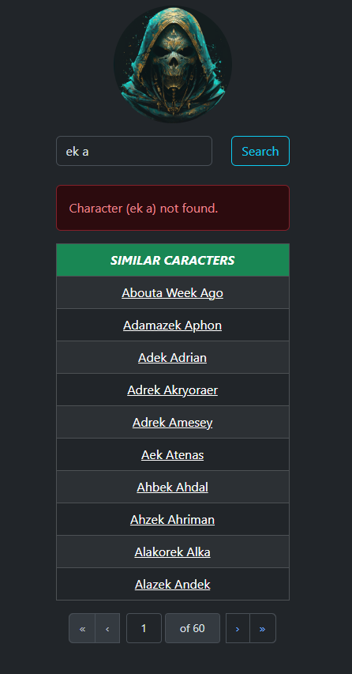

# Repository moved to [TibiaStalker](https://github.com/TibiaStalker/tibiastalker-frontend)
## _Tibia Enemy Other Characters Finder - Frontend_

<table>
    <tr>
        <td>
            Tibia Enemy Other Characters Finder - Frontend is a simple React.js with TypeScript application that helps players detect other characters of their enemy.
        </td>
    </tr>
</table>

### Web Api

You can check out https://www.tibiastalker.pl/

## Screenshots

<h4 align="center">Example searching with suggestions</h>

<h4 align="center">Example result</h>

<h4 align="center">Example error with similar characters</h>

